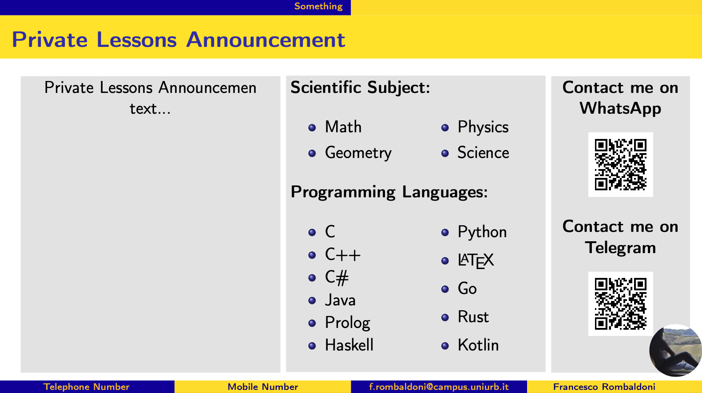

# Private lessons announcement template

### Demo image:
-   

---
## How to create your personal private lessons announcement online for free! 
1.  Fork this repository by pressing the second button at the top right.
2.  Rename the repository as you want and change the description then Fork it!
3.  ⚠️ You have to activate "Actions" on your repo; go to "Actions", click on "I understand my workflows, go ahead and enable them" ⚠️
4.  Working into "Template" folder:
    1.  Upload your images using GitHub into the images folder!  
        (Use the demo image on GitHub as reference for images)
        1.  Access the folder from main page.
        2.  "Add file" -> "Upload files" -> drag and drop your images here.
        3.  At the end, "Commit changes".
    2.  Edit the template file on GitHub using comments as reference, changing texts and images as you prefer. In the end don't forghet to "commit changes".
5.  Wait 2 minutes, got to "Actions" -> "Compile" -> click on the last one (look at the date on right) -> scroll down the page and click on "artifact file".
6.  Done! now you have your document :) .

---

# License
Shield: [![CC BY-NC-SA 4.0][cc-by-nc-sa-shield]][cc-by-nc-sa]

This work is licensed under a
[Creative Commons Attribution-NonCommercial-ShareAlike 4.0 International License][cc-by-nc-sa].

[![CC BY-NC-SA 4.0][cc-by-nc-sa-image]][cc-by-nc-sa]

[cc-by-nc-sa]: http://creativecommons.org/licenses/by-nc-sa/4.0/
[cc-by-nc-sa-image]: https://licensebuttons.net/l/by-nc-sa/4.0/88x31.png
[cc-by-nc-sa-shield]: https://img.shields.io/badge/License-CC%20BY--NC--SA%204.0-lightgrey.svg
